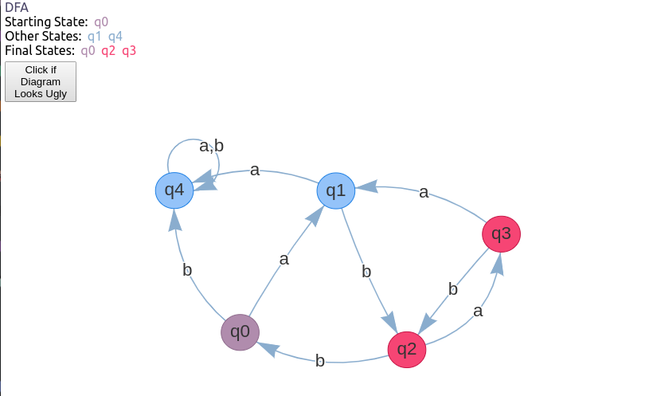
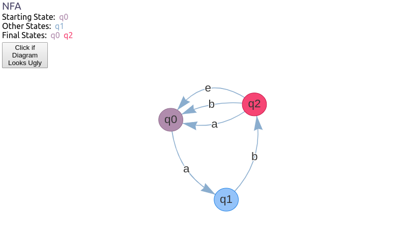

# COSC485-FiniteAutomata
Final Project for COSC485 - Theory of Computation where I render DFA and NFA state diagrams of given input strings.
This project uses Electron, webpack, React.js, along with react-vis-network for the graph visualizations and yarn for package management. 

# Set-up Instructions

### Dependency Installation
Install dependencies in project root with `yarn`

### Environment Variables
This project reads DFA and NFA definitions from a text file in the format of:
```
M = { States, Alphabet, Transition Function, Starting State, Final States }

where,

States = { q0, q1, q2 },

Alphabet = { a, b },

Starting State = q0,

Final States = { q2 },

Transition Function = {
        ( q0, a, q1 ),
        ( q1, a, q1 ),
        ( q1, b, q2 )
}
```
The actual spacing of the lines doesn't matter.

### Run Dev Mode
Once that is finished, all that is needed to do is type `yarn electron-dev`

### Run Project with Commandline args
This writes the file paths to the .env file and installs yarn dependencies

#### For Windows

start.bat `{FA Definition File Path}` `{Strings file Path}` `{Results Output File Path}`

#### For Mac / Linux

bash start.sh `{FA Definition File Path}` `{Strings file Path}` `{Results Output File Path}`


# Examples

## DFA


## NFA

